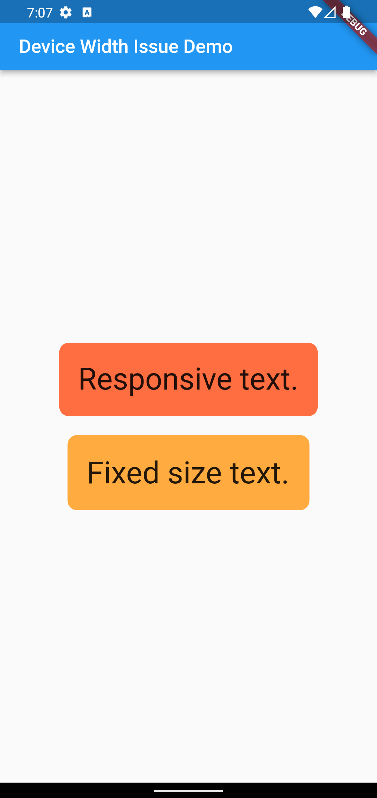

# Device Width Issue Solution

A sample project to replicate and fix issues mentioned in this [stackoverflow question](https://stackoverflow.com/questions/69851578/why-does-my-flutter-page-sometimes-not-render-completely-in-release-version).

---

## Issue

If the flutter app needs to fetch device width/height immediately when the app is launched, it always works well in **debug mode**.
However, when launched in **release mode**, some contents are not showing properly.

Attached example screenshots below.




---

## Root Cause

If the Flutter app is very lightweight, it only takes a blink of time to launch in release mode.

As of current Flutter 2.10.3, these lines are not returning correct value, if being called early when building the app:
``` dart
  MediaQuery.of(context).size.width;
  MediaQuery.of(context).size.height;
  
  WidgetsBinding.instance.window.physicalSize.width;
  WidgetsBinding.instance.window.physicalSize.height;
```

---

## Solution (kind of hacky...)

Check [`main.dart`](./lib/main.dart) for actual implementation.

[`ResponsiveHelper.setRatio()`](./lib/responsive_helper.dart#L11) is called right after the build function is triggered ([`main.dart` line 35](./lib/main.dart#L35)). And this method will call `WidgetsBinding.instance.window.physicalSize.width` to get device display information, and set to one static field.

<br>

### Default main function to start the app:
``` dart
void main() {
  runApp(const MyApp());
}
```

### Solution - add delay task before `runApp()`:
``` dart
void main() async {
  /* 
    * Additional function call to ensure widgets flutter binding is initialized,
    * but the issue still happens if no delay task below.
  */
  WidgetsFlutterBinding.ensureInitialized();
  /* 
    * This will make splash screen lasts for the duration of the delay task.
    * 300ms looks well for me, can adjust based on your preference.
  */
  await Future.delayed(const Duration(milliseconds: 300));
  runApp(const MyApp());
}
```